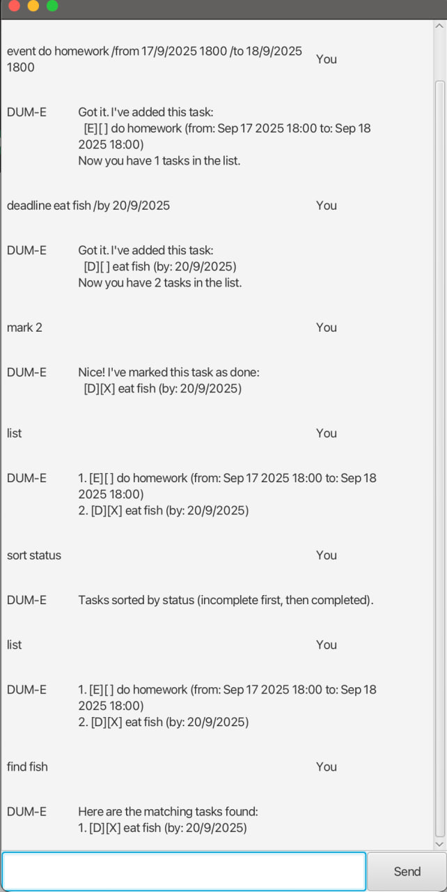

# DUM-E User Guide

DUM-E is a personal task management application that helps you keep track of your todos, deadlines, and events. It offers both command-line and graphical user interface options.



DUM-E helps you organize your tasks efficiently with features like task categorization, search functionality, and multiple sorting options. Never forget an important deadline or event again!

## Quick Start

1. Ensure you have Java 17 or above installed
2. Download the latest `dume.jar` from the releases page
3. Double-click the jar file to start the GUI, or run `java -jar dume.jar` in command line
4. Type commands in the input box and press Enter to execute
5. Type `bye` to exit the application

## Features

### Adding Todo Tasks

Add a simple task without any specific time constraints.

Format: `todo <description>`

Example: `todo Read a book`

```
Got it. I've added this task:
  [T][ ] Read a book
Now you have 1 tasks in the list.
```

### Adding Deadlines

Add a task that needs to be completed by a specific date/time.

Format: `deadline <description> /by <date/time>`

Example: `deadline Submit assignment /by 18/10/2025 2359`

```
Got it. I've added this task:
  [D][ ] Submit assignment (by: Oct 18 2025 2359)
Now you have 2 tasks in the list.
```

### Adding Events

Add an event that occurs during a specific time period.

Format: `event <description> /from <start_time> /to <end_time>`

Example: `event Team meeting /from 10/9/2025 1400 /to 10/9/2024 1600`

```
Got it. I've added this task:
  [E][ ] Team meeting (from: Sep 10 2025 1400 to: Sep 10 2024 1600)
Now you have 3 tasks in the list.
```

### Listing All Tasks

Display all tasks in your task list.

Format: `list`

```
Here are the tasks in your list:
1. [T][ ] Read a book
2. [D][ ] Submit assignment (by: Oct 18 2025 2359)
3. [E][ ] Team meeting (from: Sep 10 2025 1400 to: Sep 10 2025 1600)
```

### Marking Tasks as Done

Mark a task as completed.

Format: `mark <task_number>`

Example: `mark 1`

```
Nice! I've marked this task as done:
  [T][X] Read a book
```

### Unmarking Tasks

Mark a completed task as not done.

Format: `unmark <task_number>`

Example: `unmark 1`

```
OK, I've marked this task as not done yet:
  [T][ ] Read a book
```

### Deleting Tasks

Remove a task from your task list.

Format: `delete <task_number>`

Example: `delete 2`

```
Noted. I've removed this task:
  [D][ ] Submit assignment (by: Oct 18 2025 2359)
Now you have 2 tasks in the list.
```

### Finding Tasks

Search for tasks containing specific keywords (case-insensitive).

Format: `find <keyword>`

Example: `find book`

```
Here are the matching tasks found:
1. [T][ ] Read a book
```

### Sorting Tasks

Sort your tasks by different criteria.

Format: `sort <type>`

Available sort types:
- `chrono` or `chronological` - Sort by date (deadlines and events first, then todos)
- `alpha` or `alphabetical` - Sort alphabetically by task description
- `status` - Sort by completion status (incomplete tasks first)

Example: `sort chrono`

```
Tasks sorted chronologically (deadlines and events by date).
```

### Exiting the Application

Close the application and save your tasks.

Format: `bye`

```
Bye. Hope to see you again soon!
```

## Task Format Legend

- `[T]` - Todo task
- `[D]` - Deadline task  
- `[E]` - Event task
- `[X]` - Completed task
- `[ ]` - Incomplete task

## Data Storage

Your tasks are automatically saved to `data/dume.txt` and will be loaded when you restart the application. No manual saving required!

## Command Summary

| Action | Format | Example                                                 |
|--------|--------|---------------------------------------------------------|
| Add Todo | `todo <description>` | `todo Read book`                                        |
| Add Deadline | `deadline <description> /by <time>` | `deadline Submit report /by 12/12/2025`                 |
| Add Event | `event <description> /from <start> /to <end>` | `event Meeting /from 11/12/2025 2pm /to 11/12/2025 4pm` |
| List Tasks | `list` | `list`                                                  |
| Mark Done | `mark <number>` | `mark 3`                                                |
| Unmark | `unmark <number>` | `unmark 3`                                              |
| Delete | `delete <number>` | `delete 2`                                              |
| Find | `find <keyword>` | `find assignment`                                       |
| Sort | `sort <type>` | `sort chrono`                                           |
| Exit | `bye` | `bye`                                                   |